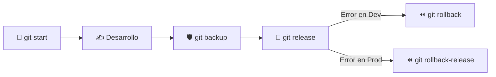

# 🚀 Git Tools – Zero-Setup, Backup, Release & Rollback

[](https://git-scm.com/)
[](LICENSE)

Un conjunto de **alias inteligentes para Git** diseñados para acelerar la creación de proyectos, automatizar versionados por fecha y proporcionar una red de seguridad (snapshots y rollbacks) sin fricción.

---

## ⚡ Referencia Rápida de Comandos

| Comando | Descripción | Ejemplo de Uso |
| :--- | :--- | :--- |
| **`git start`** | Inicializa el proyecto, crea el commit, detecta o configura `origin` y publica `main` | `git start "Inicio de app" https://github.com/user/repo.git` |
| **`git backup`** | Crea un snapshot temporal inmediato (`backup-YYYY-MM-DD-HHMMSS`) | `git backup` |
| **`git release`** | Publica una versión estable auto-incrementada (`vYYYY.MM.DD[.N]`) | `git release "Versión estable con auth"` |
| **`git rollback`** | Vuelve al último **backup o release** disponible | `git rollback` |
| **`git rollback-release`** | Vuelve únicamente al último **release estable** (ignora backups) | `git rollback-release` |

---

## 📱 App Móvil Instalable (PWA)

¡Llevá **Git Tools** en tu celular! Podés instalar la PWA como una app nativa en Android e iOS:

👉 **[Abrir App Móvil (PWA)](app/index.html)**

* **📲 Instalable en 1-tap:** Banner para agregarlo a la pantalla de inicio de tu teléfono.
* **⚡ Generador de Comandos:** Formulario interactivo en tiempo real para armar comandos y copiarlos.
* **🌐 100% Offline:** Funciona sin conexión a internet mediante Service Workers.
* **📱 Guía para Termux:** Instrucciones para ejecutar Git desde tu celular Android.

---

## ⚙️ Instalación

Elegí la opción según tu sistema/consola:

- **Windows (Doble Click / CMD):** Hacé doble click en `install.bat` o ejecutá:
  ```cmd
  install.bat TU_USUARIO_GITHUB
  ```
- **Git Bash / Linux / Mac:**
  ```bash
  sh install.sh TU_USUARIO_GITHUB
  ```
- **PowerShell:**
  ```powershell
  .\install.ps1 -GitHubOwner TU_USUARIO_GITHUB
  ```

> [!NOTE]
> **¿Ya tenías atajos instalados?** Es 100% seguro volver a ejecutar la instalación. Git sobrescribe o agrega únicamente los alias faltantes (como `git start`) sin duplicar líneas ni alterar otras configuraciones de tu sistema.

> [!TIP]
> Cada persona configura su propio usuario de GitHub durante la instalación. Si la carpeta local y el repositorio remoto tienen el mismo nombre, `git start` puede publicar automáticamente en `https://github.com/<usuario>/<carpeta>.git`. Para repositorios de otra cuenta u organización, pasá la URL explícitamente.

<details>
<summary><b>👉 Click aquí para ver los comandos de instalación manual (copiar y pegar)</b></summary>

```bash
# Alias start
git config --global alias.start '!f(){ msg="Initial commit"; remote=""; for arg in "$@"; do case "$arg" in http://*|https://*|git@*) remote="$arg" ;; *) msg="$arg" ;; esac; done; git init || exit 1; git branch -M main || exit 1; git add . || exit 1; if git rev-parse --verify HEAD >/dev/null 2>&1; then if ! git diff --cached --quiet; then git commit -m "$msg" || exit 1; fi; else git commit -m "$msg" || git commit --allow-empty -m "$msg" || exit 1; fi; if [ -z "$remote" ]; then remote=$(git remote get-url origin 2>/dev/null || true); fi; if [ -z "$remote" ]; then owner=$(git config --global --get git-tools.github-owner 2>/dev/null || true); repo=${PWD##*/}; if [ -n "$owner" ]; then remote="https://github.com/$owner/$repo.git"; fi; fi; if [ -z "$remote" ]; then echo "ERROR: no se encontro un repositorio remoto."; exit 1; fi; current=$(git remote get-url origin 2>/dev/null || true); if [ "$current" != "$remote" ]; then git remote remove origin 2>/dev/null || true; git remote add origin "$remote" || exit 1; fi; git push -u origin main || exit 1; echo "Proyecto inicializado y publicado en: $remote"; }; f'

# Alias backup
git config --global alias.backup '!sh -c "d=$(date +%Y-%m-%d-%H%M%S); git add .; git diff --cached --quiet || git commit -m \"Backup $d\"; git tag backup-$d; git push origin HEAD; git push origin backup-$d"'

# Alias release
git config --global alias.release '!f(){ msg=${1:-"Versión estable"}; base=v$(date +%Y.%m.%d); tag=$base; n=1; git add .; git commit -m "$msg" || true; git push origin main; while git rev-parse -q --verify "refs/tags/$tag" >/dev/null || git ls-remote --tags origin | grep -q "$tag"; do tag="$base.$n"; n=$((n+1)); done; git tag -a "$tag" -m "$msg"; git push origin "$tag"; echo "✅ Release creado: $tag"; }; f'

# Alias rollback
git config --global alias.rollback '!f(){ tag=${1:-""}; git fetch --tags; if [ -z "$tag" ]; then tag=$(git for-each-ref --sort=-creatordate --format "%(refname:short)" refs/tags | grep -E "^(backup-|release-|v)" | head -n 1); if [ -z "$tag" ]; then echo "❌ No se encontraron ni backups ni releases."; exit 1; fi; echo "ℹ️ No se especificó tag, usando último encontrado: $tag"; fi; git reset --hard "$tag"; if git remote | grep -q origin; then git push origin main --force; fi; echo "⏪ Rollback completado a: $tag"; }; f'

# Alias rollback-release
git config --global alias.rollback-release '!f(){ tag=${1:-""}; git fetch --tags; if [ -z "$tag" ]; then tag=$(git for-each-ref --sort=-creatordate --format "%(refname:short)" refs/tags | grep -E "^(release-|v)" | head -n 1); if [ -z "$tag" ]; then echo "❌ No se encontraron releases para volver atrás."; exit 1; fi; echo "ℹ️ No se especificó tag, usando último release: $tag"; fi; git reset --hard "$tag"; if git remote | grep -q origin; then git push origin main --force; fi; echo "⏪ Rollback a release completado: $tag"; }; f'
```
</details>

---

## 🔄 Flujo de Trabajo Recomendado



1. **Crear proyecto:** `git start "Inicio del proyecto"`
2. **Snapshot de seguridad:** `git backup` (antes de refactorizar o probar cambios importantes)
3. **Liberar versión estable:** `git release "Versión 1.0 finalizada"`
4. **Restaurar si algo falla:** `git rollback` (vuelve al último backup) o `git rollback-release` (vuelve al último release)

---

## 📖 Documentación Extendida

Para conocer el comportamiento interno de cada comando, manejo de casos borde y la filosofía del proyecto:

👉 [Manual Completo de Usuario y Referencia Técnica](docs/manual_git.md)

---

## 📄 Licencia

Este proyecto se distribuye bajo la licencia [MIT](LICENSE). Podés usarlo, modificarlo y compartirlo libremente.
